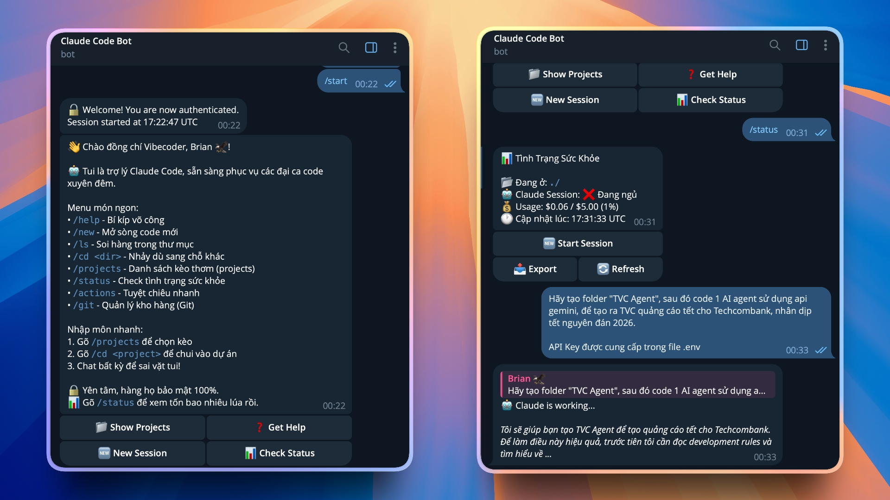

<div align="center">


[](https://github.com/sponsors/0xAstroAlpha)
[](https://buymeacoffee.com/astroalpha)

# 🤖 Claude Code Telegram Boss - Vibecoder 版 😎

> **警告：** 这个机器人不适合严肃的人。仅供"Vibecoder"夜猫子程序员使用。

**通过 Telegram 远程控制 Claude Code CLI**

*将 Telegram 变成强大的终端，Claude Code 作为您的 24/7 AI 助手。*

---

### 🌍 Languages / Ngôn ngữ / 言語 / 语言

[](README.en.md)
[](README.vi.md)
[](README.zh.md)
[](README.ja.md)
[](README.ko.md)
[](README.fr.md)
[](README.es.md)
[](README.de.md)

---

[功能](#-强大功能) • [安装](#-快速安装) • [文档](#-文档) • [安全](#-坚如磐石的安全)

</div>



---

## 🚀 强大功能

| 功能 | 描述 |
|------|------|
| 🧠 **智能聊天** | 完整的 Claude Code 功能：读取、写入、Bash、Git... |
| 📁 **文件浏览器** | 使用内联按钮浏览文件、查看代码、删除文件 |
| 📊 **Git 集成** | 直接在 Telegram 中检查状态、差异、日志 |
| 🔐 **安全优先** | 目录沙箱、用户白名单、审计日志、速率限制 |
| ⚡ **异步核心** | 异步架构，性能超快 |

## 🛠 快速安装

### 1. 前置要求
- **Python 3.10+**
- **Claude Code**（已登录）：`npm install -g @anthropic-ai/claude-code && claude login`
- **Telegram Bot Token**（来自 @BotFather）

### 2. 安装
```bash
git clone https://github.com/0xAstroAlpha/Claude-Code-Telegram-Boss.git
cd Claude-Code-Telegram-Boss

# 安装依赖
pip install poetry
poetry install

# 配置
cp .env.example .env
# 编辑 .env：添加 Bot Token、允许的用户、批准的目录
```

### 3. 运行
```bash
./start_bot.sh
```

## 📚 文档

详细文档位于 `docs/` 文件夹：

- [📝 项目概述和需求](../project-overview-pdr.md) - 项目概述和需求。
- [🏗️ 系统架构](../system-architecture.md) - 系统架构详情。
- [💻 代码库摘要](../codebase-summary.md) - 开发者代码结构。
- [📏 代码标准](../code-standards.md) - 编码标准和工作流程。

## 🎮 用户指南

### 基本命令
| 命令 | 描述 |
| :--- | :--- |
| `/start` | 启动机器人 |
| `/new` | 创建新会话（重置上下文） |
| `/ls`, `/cd`, `/pwd` | 使用命令浏览文件 |
| `/browse` | 打开文件浏览器（UI） |
| `/git` | Git 菜单（状态、日志、差异） |

### 示例
> **您：** "修复文件 `src/main.py` 中的错误，第 50 行有导入错误。"
>
> **Claude：** "好的，让我检查该文件..." (运行 `Read` 工具) -> "找到错误，正在修复..." (运行 `Edit` 工具) -> "完成！"

## ⚙️ 配置（.env）

```env
TELEGRAM_BOT_TOKEN=123456:ABC-DEF...
ALLOWED_USERS=["your_telegram_id"]
APPROVED_DIRECTORY=/path/to/your/project
CLAUDE_MODEL=claude-3-5-sonnet-20241022
```

## 🔐 坚如磐石的安全

1. **用户白名单：** 只有授权 ID 才能与机器人交互。
2. **目录沙箱：** 机器人仅限于 `APPROVED_DIRECTORY`。
3. **审计日志：** 记录所有敏感操作。
4. **工具过滤器：** 阻止危险命令（`rm -rf`、`format` 等）。

---

<div align="center">

**[⬆ 返回顶部](#-claude-code-telegram-boss---vibecoder-版-)**

*Made with ❤️ & ☕ by a Vibecoder*

</div>
